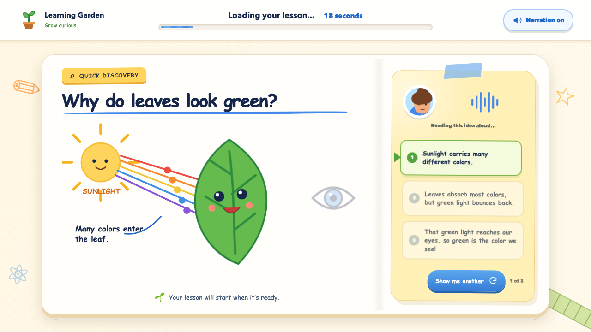

# SR1 Lesson Loader

A framework-free prototype that turns a 20-second video delay into a short,
narrated STEM discovery for K-12 learners.

[View the live prototype](https://zilongwang-uno.github.io/learning-garden-loader/)



## Experience

When a student starts the lesson, the video area temporarily becomes a
`Quick Discovery`. A three-part explanation is read aloud while a synchronized
illustration develops on screen. A persistent `Up next` bar makes it clear that
the discovery is playing while the lesson video loads.

After 20 seconds, the interface pauses and lets the student choose when to
start the lesson video.

The prototype includes three discoveries:

- Why leaves look green
- Why programmers use loops
- How coordinates guide a robot

Topics are selected randomly without repeating until the student has seen the
full set. Viewing history is stored locally in the browser.

## Design decisions

- The waiting experience stays inside the video player so the page does not
  shift or lose context.
- `Quick Discovery`, the loading status, and `Up next` establish a clear
  relationship between the activity and the lesson video.
- Narration and matching captions support different reading preferences.
- Students can mute narration without pausing the visual explanation.
- Keyboard focus styles, semantic controls, readable contrast, responsive
  layouts, and reduced-motion support improve accessibility.

## Technical approach

The project uses plain HTML, CSS, and JavaScript with no dependencies or build
step. The animated illustrations are inline SVG, narration uses the browser's
Speech Synthesis API, and topic rotation uses `localStorage`.

## Run locally

```bash
python3 -m http.server 4173
```

Open `http://localhost:4173`.

## Project structure

```text
index.html   Page structure and lesson content
styles.css   Layout, visual system, and responsive styles
topics.js    Discovery text and inline SVG illustrations
script.js    Loading sequence, narration, topic rotation, and interactions
```

No package installation or build step is required.

On mobile, selecting the lesson first pauses at a rotate-device prompt. The
20-second discovery begins only after the student confirms. The player then
requests full-screen landscape mode so the discovery and lesson video share the
same immersive surface. Android browsers generally support the automatic
transition; iPhone browsers may require the student to rotate manually.
